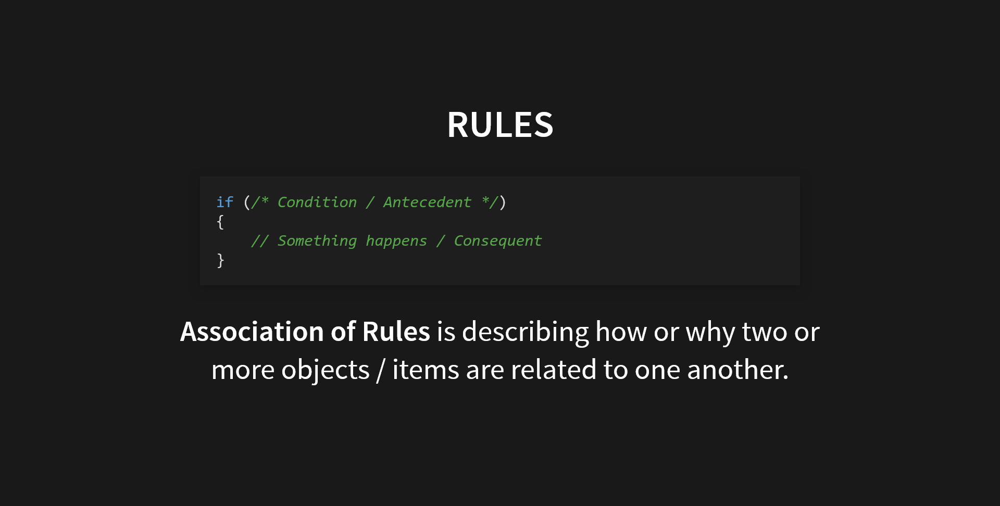

# BitsApriori: Binary Encoded Transactions


*NOTE: Assuming that if you are reading this you already know what is Association Rule Mining and are aware of Apriori Algorithm.*

This is a small project I worked on under the guidance of [Dr. Himanshu Gajera](https://www.linkedin.com/in/himanshu-gajera/) for my university course, Machine Learning. Association Rule Mining was not really a topic in our syllabus but ever since I learnt about this, I had this idea of encoding the rules into binary numbers. In essence, instead of storing the transactions as a sparse matrix, the idea was to store a single number corresponding to its binary encoded value:

| TID | i1 | i2 | i3 | binary |
| --- | -- | -- | -- | ------ |
| t1 | 1 | 0 | 1 | 101 = 5 |
| t2 | 0 | 0 | 1 | 100 = 4 |
| t3 | 1 | 1 | 0 | 011 = 3 |

After finishing the project I got to know that the concept of storing transactional data like this is out there for quite some time. Nevertheless the benefits of storing the transactions like this are quite clear and in this project I have implemented simple Apriori that can process this binary encoded data in C++. The advantages are:
1. Saves a ton of memory as the data size grows.
2. Adding new items is also quite simple.
3. Performing bitwise operations is not computationally expensive.
### 1. Saving Memory
If we simply do the maths for a dataset of 100 items and 100 transactions, storing each entry as a boolean in a tabular format would take:
```
Per transaction: 1 byte * 100 items = 100 bytes
Total: 100 bytes * 100 tranasctions = 10000 bytes
```
On the other hand, if the data is encoded we would require:
```
Per transaction: 1 bit * 100 items = 100 bits = 12.5 bytes
Total: 12.5 bytes * 100 transactions = 1250 bytes
```
We are not considering the additional list of strings to store the IDs but still 1250 bytes is a significant difference compared to 10000 bytes. Moreover this is just a simple example, in real world the data has a lot more than a 100 transactions and 100 items.
#### But wait, there is more!
In my implementation, I have divided each transaction into block of **k bits**. For simpler implementation the value for *k* can be kept smaller however depending on the total items we can increase this. The value of *k* must be in the power of 2 (i.e. 2, 4, 6, 8, 16, 32, ...). Let me simplify this *k* for you:  
Imagine there are 8 items.  
LSB of the binary number is item0 and MSB is item8.  
Now, if a transaction only has item1, item2 and item3 in it.  
Ideally you would store 00001110.  
But with a block size k = 4, we are only storing 1110.  
The rest of the unused bits will not occupy the memory.  
Using this method I was able to squeeze in more memory optimization into this project!
### 2. Adding New Items
Since we are dividing each transaction into smaller sized blocks, adding a new item becomes very simple because the item would be added at the MSB only and transactions that do not have that new item are not needed to be modified!
### 3. Performing Bitwise Operations
If I need to check if an item is in the transaction, we can simply perform a bitwise AND operation with the appropriate binary number. Now, as compared to the matrix where we are able to simply perform a lookup on the table, this is slower. But due to the sparse nature of the table the [simple storage](https://jaynakum.github.io/BitsApriori/#/6) approach is preferred over the [horizontal storage](https://jaynakum.github.io/BitsApriori/#/7). And performing an AND operation would be much more quicker than traversing a whole list of items.
## Project Implementation
The project is developed in C++ with the following classes:
- **Itemset**: This class is the abstraction over the binary encoding. It handles all the bit level operations. It manages the array of blocks.
- **Items**: It stores a long list of all the items. It is to maintain the order of the items. For faster lookups, I had used a hash-map instead of an array.
- **Rule**: This class is a combination of two itemset, representing the antecedent and consequent of the rule.
- **Apriori**: It is the core of the project. It takes in minimum support, confidence & lift and it calculates the association rules using the binary encoded data.

You can find the complete documented implementation at `src\main.cpp` on my GitHub:
[](https://github.com/JayNakum/BitsApriori)
If you have any suggestions or comments and you like this project, let me know on twitter [@JayNakum_](https://twitter.com/JayNakum_).
## Thanks for reading, Aavjo!