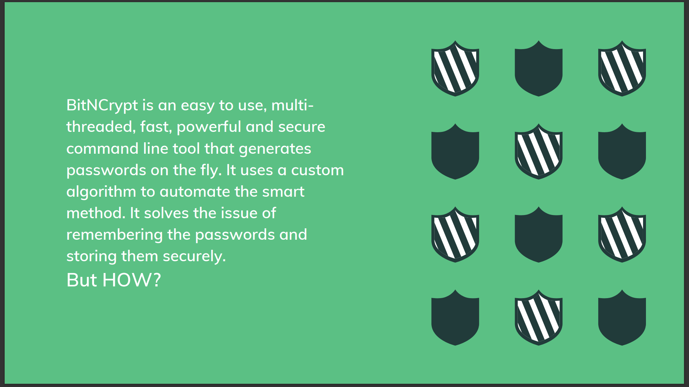
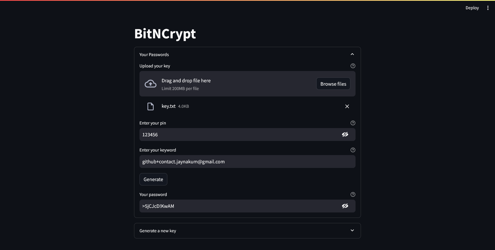

# Revisiting BitNCrypt: A password manager that doesn't store passwords


I'm quite proud of this one! In this blog I have revisited BitNCrypt, it is a custom made algorithm that generates password and it works like a hash function. I developed this project for my university subject Information Security and it was guided by [Dr. Hargeet Kaur Madam](https://www.linkedin.com/in/dr-hargeet-kaur-33a1a3109/). Now, if you know what are the hash function's properties, you already know what this project is. A simple yet surprisingly efficient solution to manage passwords. The primary questions that I will be answering in this blog are:
1. Why to use such tool?
2. What is BitNCrypt?
3. How BitNCrypt works?

## Why BitNCrypt?
Usually the problems with attack prone passwords are:
- People just use insecure passwords because they don't want to remember complex passwords.
- People use complex password but it is same on every website and service.
- Using password manager that is not so secure.

Some of the existing solutions are:
- Using complex passwords, but it is easy to get overwhelmed with the amount of passwords that is needed to be remembered.

An example of a password generated by BitNCrypt:


## What is BitNCrypt?
The smart way, that is recommended and is very effective, is to remember a keyword and have a simple method (that you can do in your head) that uses that keyword and the result is your password. But very few people uses this approach (not even me).  
BitNCrypt is just that! But since we're using computers, the algorithm is not simple and something you can do in your head.

## How it works?
This project was initially coded in C++ and my main aim was not to have a password manager. My goal behind this was to learn multi threading, hence I forced multithreading into this project even though it is not necessary. The [web tool](https://twodollartools.streamlit.app/BitNCrypt/) of this project is coded using python and it is a much more simpler version of the overcomplicated C++ project. In this blog I have taken code snippet from both the projects, whichever was easier to understand.
### The three terms:
1. Pin: A 6 digit pin that user needs to remember.
2. Key: A txt file containing a random jumble of words.
3. Keyword: A different keyword for each password.

### The Algorithm:
In the C++ project, user needed to provide a txt file with some text that was jumbled randomly once and used by the system. In the web tool it is simplified to just providing a random string of 4096 characters.
```C++
std::thread jumbleFile([&]() {
	std::string bytes = "";
    for (int c : data)
    {
        bytes += c;
        if (Math::random(1))
            bytes += c - Math::random();
        else
            bytes += c + Math::random();
    }
}
```

The main algorithm to generate password is divided into 4 sections:
1. AND operation
2. Shifting
3. XOR operation
4. Final selection

#### 1. AND Operation
In this step the pin and the keyword are made the same length as of the key and then logical AND operation is performed between all three.
```C++
std::thread t_keyword([&]() {
	while (keyword.length() < key.length())
		keyword += keyword;
}

std::thread t_pin([&]() {
	while (pin.length() < key.length())
		pin += pin;
}

// waiting for both the threads to complete the execution
t_keyword.join();
t_pin.join();

// perform AND operation
std::string result = "";
for (int i = 0; i < txt.length(); i++)
{
	result += pin[i] & keyword[i] & key[i];
}
```
#### 2. Shifting Operation
The result of the AND operation is divided into 6 sections and each section is then either right shifted or left shifted depending upon the key.
```python
i = 0
for section in sections:
	b_section = section.encode()
	if (int(pin[i]) % 2):
		result += str(int.from_bytes(b_section, sys.byteorder) << int(pin[i]))
	else:
		result += str(int.from_bytes(b_section, sys.byteorder) >> int(pin[i]))
	i += 1
```
#### 3. XOR Operation
It is just a simple XOR operation with the key.
```python
result = str(int.from_bytes(b_round2, sys.byteorder) ^ int.from_bytes(b_key, sys.byteorder))
```
#### 4. Final Selection
In this step, the result from the XOR is divided into 12 sections, hence the resulting password will be of length 12. And form each section one byte is selected. This selection happens using the pin. For example, if the pin is 940925 then from the 1st section the 9th byte will be selected then from the 2nd section 4th byte will be selected and so on. Each byte is then treated as a character using ascii value and the character is converted into a valid symbol that can be used in a password.  
In the C++ version of this section, I was limiting the ascii for a-z characters only and then some special characters and numbers were added later. However, in that version I was appending some numbers from the `pin` directly. Due to which the pin could be brute-forced with enough password samples. Now I've modified the code to give ascii character for all the printable characters directly i.e. A-Z, a-z, 0-9 and symbols.
```python
sections = _divide_string(round3, 12)
i = 0
for section in sections:
	byte_representation = int(section).to_bytes((int(section).bit_length() + 7) // 8)
	ascii_codes = [byte for byte in byte_representation]
	result += chr(((ascii_codes[int(pin[i]) % len(ascii_codes)]) % 94) + 33)
	i += 1
	if i >= 6 : i = 0
print(result)
```

You can checkout this tool at [TwoDollarTools](https://twodollartools.streamlit.app/).
If you have any suggestions or comments and you like this project or you want to learn more, lets connect on twitter [@JayNakum_](https://twitter.com/JayNakum_).
## Thanks for reading, Aavjo!

<script data-name="BMC-Widget" data-cfasync="false" src="https://cdnjs.buymeacoffee.com/1.0.0/widget.prod.min.js" data-id="jaynakum" data-description="Support me on Buy me a coffee!" data-message="Consider supporting?" data-color="#FF813F" data-position="Right" data-x_margin="18" data-y_margin="18"></script>