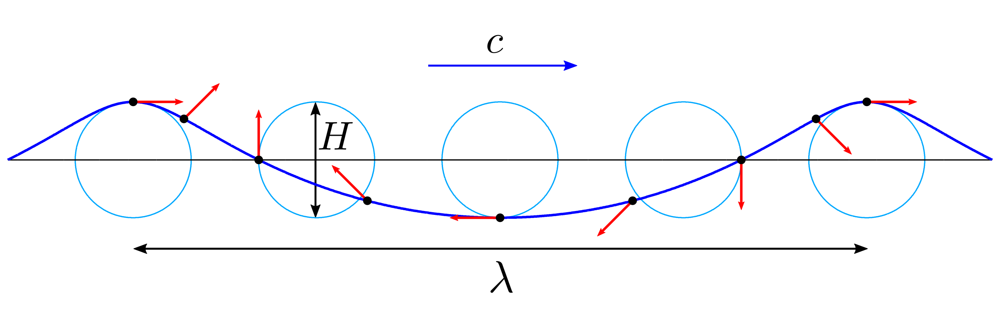

# RTT: Rendering Water using Gerstner (Trochoidal) Waves

Welcome to the first of many Render Tech Tuesday, RTT for short. This is a not-so-regular blog series where we will be going on coding adventures with anything and everything related to rendering.


For this one, we have the most basic water rendering using [Gerstner Waves, also known as Trochoidal Waves](https://en.wikipedia.org/wiki/Trochoidal_wave). 

## A bit about [Harmony](https://gist.github.com/JayNakum/dd0d9ba632b0800f39f5baff9f85348f)
Harmony has been my passion project for over a year and, during that, it has been through two rewrites. It initially started for me to learn direct X. I started with DX9 and then I attempted it to rewrite it using DX12 which I  mentioned in my [previous post](https://jaynakum.github.io/blog/4/IECS). But I failed terribly. The more I understood DX12, the more I realized that the DX9 interface would simply not work. And even if I did make it work, I would not be utilizing the power and control that this new API has to offer. So, starting Feb 6th 2025, I deleted everything and rewrote it.  
Before I started with the rewrite, I read [Game Programming Patterns by Robert Nystrom](https://gameprogrammingpatterns.com/). It is an awesome awesome book (I wish all the text/reference books were written like this) and it had unlocked that initial barrier of the ability to not just code but to design good systems as well.

Now, harmony has **multi pass rendering**. A system called **ShaderInputs** to manage root signature creation, binding and complete descriptor management. All tied with a crude but functional  **multi threading** allowing each group of independent render passes to fill their respective command buffers in parallel.  
It is also developed with keeping **multiple graphics APIs** in mind, allowing me to implement another API easily whenever I want to learn another one.

All in all, Harmony is the perfect place for me to satisfy my itch of writing good code. Here, I am not afraid to re-write entire systems (seriously, I deleted 3 fully working implementations of the ShaderInputs system because I came up with a somewhat better way to implement it). This project is being developed with one focus in mind which is that it should allow me to do experiments and the project has taught me A LOT over the last year!

I am maintaining a public github gist for Harmony. It is similar to John Carmack's plan file which you can [check out here](https://gist.github.com/JayNakum/dd0d9ba632b0800f39f5baff9f85348f) and you can check the work done so far in the revisions tab.

## Water Rendering
Now, on to the main topic, Gerstner Waves. 
```
x = x + Q * A * Dx * cos(phi)
y = A * sin(phi)
z = z + Q * A * Dy * cos(phi)

where
phi = k * (Dx * x + Dy * z) - (w * t)
```

```
x, y, z: coordinates of the vertex
Q: steepness
A: amplitude
D: wave direction (x, y)
k: 2 * PI / waveLength
w: angularFreq (sqrt(G * k), for deep waters)
G: gravity (9.81ms2)
t: time
```

It is one of the simplest and commonly used wave function. It essentially moves each point up and down (like a simple sine wave) and sideways as well, as if each bit of water were riding around in a small circular orbit beneath a crest.  
If I were to simplify the above formula in two dimensions, it is just (cos(x), sin(x)).  
Where the y ie the height of the wave is determined by the sine value and the water displacement along the x axis is determined by the cosine value.



Now to move all of this moved forward with respect to time, we add *t*. And the rest are the variables to give us some control over the waves. If you are kinda understanding this, please continue reading.

## Going step by step.
So lets start simple. We need start with a plane which we will be animating to make it look like water (yes water in video games is fake).  
In order to get the vertices and indices for the plane, I implemented this simple function that creates a grid of vertices with some variable to control the size and points along each axis.
```C++
MeshData createGrid(float width, float depth, uint32_t m, uint32_t n)
{
	MeshData meshData;

	uint32_t vertexCount = m * n;
	uint32_t faceCount = (m - 1) * (n - 1) * 2;

	// create the vertices.
	float halfWidth = 0.5f * width;
	float halfDepth = 0.5f * depth;

	float dx = width / (n - 1);
	float dz = depth / (m - 1);

	float du = 1.0f / (n - 1);
	float dv = 1.0f / (m - 1);

	meshData.vertices.resize(vertexCount);
	for (uint32_t i = 0; i < m; ++i)
	{
		float z = halfDepth - i * dz;
		for (uint32_t j = 0; j < n; ++j)
		{
			float x = -halfWidth + j * dx;

			meshData.vertices[i * n + j].position = vec3f(x, 0.0f, z);
			meshData.vertices[i * n + j].normal = vec3f(0.0f, 1.0f, 0.0f);
			meshData.vertices[i * n + j].tangentU = vec3f(1.0f, 0.0f, 0.0f);

			// Stretch texture over grid.
			meshData.vertices[i * n + j].textureCoord.x = j * du;
			meshData.vertices[i * n + j].textureCoord.y = i * dv;
		}
	}

	// create the indices.
	meshData.indices32.resize(faceCount * 3); // 3 indices per face

	// Iterate over each quad and compute indices.
	uint32_t k = 0;
	for (uint32_t i = 0; i < m - 1; ++i)
	{
		for (uint32_t j = 0; j < n - 1; ++j)
		{
			meshData.indices32[k] = i * n + j;
			meshData.indices32[k + 1] = i * n + j + 1;
			meshData.indices32[k + 2] = (i + 1) * n + j;

			meshData.indices32[k + 3] = (i + 1) * n + j;
			meshData.indices32[k + 4] = i * n + j + 1;
			meshData.indices32[k + 5] = (i + 1) * n + j + 1;

			k += 6; // next quad
		}
	}

	return meshData;
}
```
And with this we have a simple plane on our screen. Great!


Now we will be animating this. To do that lets start with a static sine wave.
```hlsl
float3 position = float3(x, sin(x), z)
```
So by doing this in the vertex shader, we get this.


It looks confusing because we do not have any light calculations. So in order to give some depth perception, I will color the vertex based on its height. Meaning that higher the vertex, whiter its color.
```hlsl
float A = 0.5; // this is some arbitrary value
float t = saturate(input.waveHeight / (A));
float3 color = lerp(deepColor, peakColor, t);
```
And just so we can see, I am changing the clear color to black.


And as you can see, we have clearly visible sine waves! Simple enough.  
And now to animate them, we can introduce *t*. By simply adding it to our sine function.
```hlsl
float3 position = float3(x, sin(x + t), z)
```


And we have out first wave!! Although I do admit that it is not the most interesting of the waves. But to make it interesting we will introduce the displacement along the horizontal axis.  
So far, we have only been playing with the vertical axis, that is the y value of our position. But the gerstner wave also moves the point along its horizontal axis to make it appear like it is rolling.  
Now if we recall the high school algebra, we know that the plot of (cos(x), sin(x)) is a circle.


So if we do the same for both of our horizontal axis, *x* and *z*, we get
```hlsl
float3 position = float3(
	x + cos(x + gTotalTime), 
	sin(x + gTotalTime), 
	z + cos(z + gTotalTime)
);
```


And this is it! Like I said earlier, the other parameters are just to control these waves. So for example, if we multiply the cosine by some arbitrary value
```hlsl
float3 position = float3(
	x + 0.3 * cos(x + gTotalTime), 
	sin(x + gTotalTime), 
	z + 0.3 * cos(z + gTotalTime)
);
```
we get the control over the steepness (assuming that the amplitude is 1), and the peaks are a lot smoother because of a smaller steepness value.


Similarly, the direction vector controls the direction in which the *t* is applied. amplitude controls the height of each wave and the wavelength controls the distance between each peak! Easy right!

So putting it all together in the gerstner wave function, the math suddenly become a lot more clear.
```hlsl
float calculatePhase(float3 vertex, float waveLength, float2 direction, float t)
{
    float k = (2 * PI) / waveLength;
    float angularFreq = sqrt(G * k);
    float phase = (k * (direction.x * vertex.x + direction.y * vertex.z)) - (angularFreq * t);

    return phase;
}

float3 calculateOffsets(float3 vertex, float amplitude, float2 direction, float steepness, float waveLength, float t)
{
    float phase = calculatePhase(vertex, waveLength, direction, t);
    float dx = (steepness * amplitude * direction.x * cos(phase));
    float dy = amplitude * sin(phase);
    float dz = (steepness * amplitude * direction.y * cos(phase));

    return float3(dx, dy, dz);
}

main()
{
	float3 d = calculateOffsets(params);
	float3 position = float3(
		x + d.x,
		d.y,
		z + d.z
	);
}
```

And finally we have a decent looking wave, with a good control over it.


But I am sure you noticed that it still doesn't look like water. It is a better than what we had but nothing like water.  
Well, in order to make it look more realistic, we have to add multiple of these waves on top of one another.


Meaning that we need to do this calculation with different water params more than once.
```hlsl
main()
{
	float3 d1 = calculateOffsets(params1);
	float3 d2 = calculateOffsets(params2);
	float3 d3 = calculateOffsets(params3);
	float3 d = d1 + d2 + d3;
	float3 position = float3(
		x + d.x,
		d.y,
		z + d.z
	);
}
```

And with three waves and these parameters we finally get our water looking like this!
```C++
WaterParams params
{
    { 0.2f, 0.1f, 0.15f }, // amplitude
    { vec2f(1,0), vec2f(-0.5f,0.866f), vec2f(-0.5f,-0.866f) }, // direction
    { 0.80f, 0.60f, 0.40f }, // steepness
    { 10.0f, 6.0f, 3.0f } // wavelength
};
```


## What next?
Well, we have barely dipped our toes today AND this is good, but we need better. So, how can we make it better? There are SO MANY improvements possible.

Simple ones being lights, reflections, refractions, shadows, skybox, fog, etc.

And some comparatively complex improvements. Such as, we notice a lot of repetition in our water pattern. And in order to reduce them, the solution is to add more waves! In AAA water renderers, there are millions of sine waves super imposed in order to achieve a realistic wave.

So how do they do it without burning GPUs? The answer is FFTs.  
All the calculation done so far, was in time domain (with respect to *t*). But in order to optimize and compute millions of waves, we do the same calculation in frequency domain instead. Doing so it MUCH faster and then we convert it to time domain using inverse Fourier transform. Which allows us to achieve much better results with a lot less repetition. The patterns will always repeat at some point because of our computational limits but those can be unnoticeable.

Then there are additional shaders for rendering foam and spray which can be explored as well.

## References
1. How Games Fake Water - Acerola - [link](https://youtu.be/PH9q0HNBjT4)
2. I Tried Simulating The Entire Ocean - Acerola - [link](https://youtu.be/yPfagLeUa7k)
3. Coding Adventure: Gerstner Waves - Renatus - [link](https://youtu.be/V4yZigMSLiU)
4. Trochoidal wave - WikiPedia - [link](https://en.wikipedia.org/wiki/Trochoidal_wave)

---

Since you have read this far, here is the complete hlsl of today's implementation as a reward! XD
```
static const uint NUM_WAVES = 3;
static const float PI = 3.14159265358979323826264;
static const float G = 9.81f;

cbuffer cbFrame : register(b0)
{
    float gTotalTime;
    float gDeltaTime;
    uint _framePadding0;
    uint _framePadding1;
};

struct WaterParams
{
    float amplitude;
    float2 windDirection;
    float steepness;
    float wavelength;
    float _waterParamsPadding0;
    float _waterParamsPadding1;
    float _waterParamsPadding2;
};

cbuffer cbWaterParams : register(b1)
{
    WaterParams gWaterParams[NUM_WAVES];
};

cbuffer cbPass : register(b2)
{
    float4x4 gView;
    float4x4 gInvView;

    float3 gEyePosW;
    uint cbPassPadding0;

    float4x4 gProj;
    float4x4 gInvProj;

    float gNearZ;
    float gFarZ;
    uint cbPassPadding1;
    uint cbPassPadding2;

    float4x4 gViewProj;
    float4x4 gInvViewProj;

    float2 gRenderTargetSize;
    float2 gInvRenderTargetSize;
    uint _cbPassPaddingFinal[20];
};

struct VSInput
{
    float3 position : POSITION;
    float3 normal : NORMAL;
    float3 tangentU : TANGENT;
    float2 textureCoord : TEXCOORD0;
};

struct VSOutput
{
    float4 position : SV_POSITION;
    float3 normal : NORMAL;

    float waveHeight : TEXCOORD0;
};

float calculatePhase(float3 vertex, float waveLength, float2 direction, float t)
{
    float k = (2 * PI) / waveLength;
    float angularFreq = sqrt(G * k);
    float phase = (k * (direction.x * vertex.x + direction.y * vertex.z)) - (angularFreq * t);

    return phase;
}

float3 calculateOffsets(float3 vertex, float amplitude, float2 direction, float steepness, float waveLength, float t)
{
    float phase = calculatePhase(vertex, waveLength, direction, t);
    float dx = (steepness * amplitude * direction.x * cos(phase));
    float dy = amplitude * sin(phase);
    float dz = (steepness * amplitude * direction.y * cos(phase));

    return float3(dx, dy, dz);
}

VSOutput vsMain(VSInput input)
{
    VSOutput result;
    float4x4 mvp = mul(gView, gProj);

    float3 waveOffset = float3(0.0f, 0.0f, 0.0f);
    [unroll]
    for(uint i = 0; i < NUM_WAVES; ++i)
    {
        waveOffset += calculateOffsets(
                        input.position,
                        gWaterParams[i].amplitude,
                        gWaterParams[i].windDirection,
                        gWaterParams[i].steepness,
                        gWaterParams[i].wavelength, gTotalTime);
    }

    float3 wave = input.position;
    wave.x -= waveOffset.x;
    wave.y = waveOffset.y;
    wave.z -= waveOffset.z;
    result.position = mul(float4(wave, 1.0f), mvp);
    result.waveHeight = wave.y;
    result.normal = input.normal;
    return result;
}

float4 psMain(VSOutput input) : SV_TARGET
{
    float3 deepColor = float3(0.0f, 0.3f, 0.5f);
    float3 peakColor = float3(1.0f, 1.0f, 1.0f);

    // compute wave min max
    float maxAmplitude = 0.0f;
    for (int i = 0; i < NUM_WAVES; ++i)
    {
        maxAmplitude += gWaterParams[i].amplitude;
    }

    float normalizedHeight = saturate(input.waveHeight / maxAmplitude);

    float3 finalColor = lerp(deepColor, peakColor, normalizedHeight);

    return float4(finalColor, 1.0f);
}
```

If you have any suggestions or comments and you like this post or you want to learn more, lets connect on twitter [@JayNakum_](https://twitter.com/JayNakum_) or linkedin [@JayNakum](https://www.linkedin.com/in/jaynakum/).
## Thanks for reading, Aavjo!

<script data-name="BMC-Widget" data-cfasync="false" src="https://cdnjs.buymeacoffee.com/1.0.0/widget.prod.min.js" data-id="jaynakum" data-description="Consider supporting Jay?" data-message="consider supporting?" data-color="#BD5FFF" data-position="Right" data-x_margin="18" data-y_margin="18"></script>