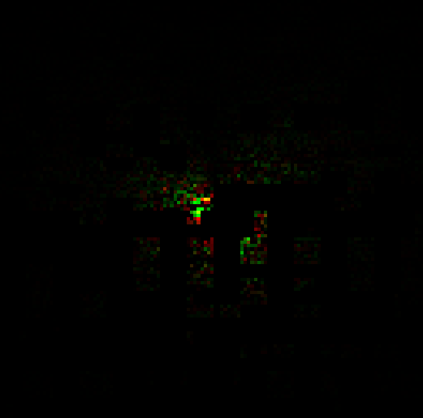

# RTT: State of the Art Water Rendering

Oh boy, it has been a long time but trust me, this is a good one. Welcome everyone and get your computers and notebooks ready because in this episode of Render Tech Tuesday, we will be demystifying Water Rendering from sum of sines to FFT, with the complete implementation and its mathematical intuition.  


## A quick [revision](https://jaynakum.github.io/blog/5/GerstnerWaves).
As a quick refresher to some basic concepts discussed in the [previous post](https://jaynakum.github.io/blog/5/GerstnerWaves), we will start from a sine wave.


And by adding these parameters to the $x$ we can control our wave:
- wave number $k$
- time $t$
- angular frequency $\omega$
- amplitude $A$


In reality though, the water waves are not just simple sine waves that define a vertical displacement. The water moves horizontally as well. This type of waves is called a [Gerstner Wave](https://jaynakum.github.io/blog/5/GerstnerWaves), where the vertical and the horizontal displacement of the waves are defined by sine and a cosine function respectively.


And since a plot of $f(x) = sin(x) + cos(x)$ gives a circle, each point in the wave moves in a circular rotation as we update the time, giving an effect of a rolling wave. It is usually a great starting point because it covers the important aspect of the horizontal and vertical displacement.

## Water Rendering
The water rendering can be summarized as

    Sum of Wave Equations

These wave equations does not have to be the gerstner wave or a sine wave or a cosine wave. They can be any wave equation we desire.

The result of adding multiple such gerstner waves, we can get decent looking stylized water. And the following output is of three gerstner waves added together.


As we can clearly see that even though it is moving, its not the most realistic looking water. And it tiles a lot i.e. it has a lot of repetitions in the wave patterns.  
Tiling is the most important and the most common problem of water rendering. In an ideal scenario we would want to have ZERO tiling, however our hardware will not allow such calculations for real-time applications. And hence the goal is to have tiling just enough that it is not noticeable.

And (one of the) solution to this problem is by increasing the number of waves.  
Right now, the output above is just 3 waves. But by adding more number of waves we can try to reduce the tiling. And the more waves we add, the lesser the tiling will become noticeable.

## Sum of Sines
There is one problem with the gerstner wave equation.  
The parameters are quite easy to mess up meaning that if we keep the amplitude too high and frequency too low (allowing waves to overlap each others radius) it is easier for the waves to curl in itself, exploding the water and breaking the immersion.


And as I mentioned earlier, wave equation can be any for of wave, I will be showcasing the Sum of Sines using a sine wave which is an exponent on the euler's number.   
The reason why I like this function is because it doesn't have the curling problem as gerstner waves and it gives sharper peaks and wider troughs, compared to a regular sine wave, which looks quite similar to the gerstner waves.

The function $h(x, t)$ will give a time dependent displacement on the $y$ axis for each $x$ in our mesh (line for now because we are in 2D).
$$
h(x, t) = A e^{\bigl(p_m \sin(k x + \omega t) - p_o \bigr)}
$$
where,  
$A$ = amplitude  
$p_m$ = max peak (control how pointy the wave is)  
$k$ = wave number  
$x$ = point in a 2D plane  
$\omega$ = angular frequency  
$t$ = time  
$p_o$ = peak offset (shift the wave down)


Now, if we add another coordinate, we get a 3D sine wave.
$$
h(x, t) = A e^{\bigl(p_m \sin(k_x x + k_y y + \omega t) - p_o \bigr)}
$$
The two wave numbers $k_x$ and $k_y$ constitute a wave vector $\mathbf{k}$, determining both *wave direction* and *wave length* and we do its dot product with the input coordinates to control the direction in which we want the wave to move. (we can control the direction in 2D as well by flipping the sign of $t$ from $+$ to $-$). 
$$
h(x, t) = A e^{\bigl(p_m \sin(\mathbf{k} \cdot x + \omega t) - p_o \bigr)}
$$
Since we want to add multiple of these waves, the resulting height field $h$ will be as follows.
$$
h(x, t) = \sum_{n=1}^N A_n e^{\bigl(p_m \sin(\mathbf{k_n} \cdot x + \omega_n t) - p_o \bigr)}
$$

## Sum of Sines using FBM
Now, if you remember from the last post, the parameters of the three gerstner waves were provided manually. However, as we increase the number of waves, it will become more and more difficult for our artists to furiously provide and fine tune the parameters for each and every wave. Meaning that we need a good way to approximate those parameters based of of some artist provided parameters.

### Enter FBM
FBM stands for [Fractional Brownian Motion](https://thebookofshaders.com/13/). It is one of the most fundamental algorithms of computer graphics where a Brownian Motion can be any random motion and for each iteration we change the parameters of our Brownian Motion by some fraction, hence the name FBM.  
The random motion can be anything such as a simplex/perlin noise. And our $h(x, t)$ can also be considered a brownian motion. And the parameters that we will be changing would be the frequency and the amplitude. 

So if I were to implement water rendering using a noise function. It would look something like this.
```C++
for (uint i = 0; i < octaves; ++i)
{
    float noise = noise(uv * frequency);
    displacement += amplitude * noise;
    
    frequency *= lacunarity; // must be greater than 1
    amplitude *= gain; // must be less than 1
}
```


For a realistic look, we want to decrease the amplitude for each iteration. Otherwise the displacement would have so much accumulated amplitude that the water would look too noisy.


And we also want to increase the frequency in each iteration to get more and more details in the waves.

The benefit of using a noise based FBM is that since noise is completely random, the water will never tile. BUT, the problem with using noise is that it becomes too complex to compute in real time and we would end up using a noise texture instead. And the noise texture itself has to tile. Meaning that it can only work for smaller water bodies.  
Moreover, even though noise is a extremely popular in water rendering using FBM, the waves generated by FBM do not accurately represent a real water surface.  
So we will stick to our exponential sine wave function for now as it also lays the fundamentals of time domain wave calculation and all of them are important for understanding the FFT technique.

Since, brownian motion can be any function, we can replace it with our $h(x, t)$ to get our Sum of Sines. Which in code, would look something like this.
```C++
void sineFBM(float2 uv)
{
    float2 p = uv;
    float displacement = 0.0f;
    float totalAmplitude = 0.0f;
    for(uint i = 0; i < waveCount; ++i)
    {
        // Calculate a random direction vector
        float2 randomDirection = float2(cos(directionSeed), sin(directionSeed));
        float2 waveDirection = normalize(randomDirection);
        
        // Exponential Sine Wave Function
        float x = dot(waveDirection, p) * frequency + time * speed;
        float wave = amplitude * exp(maxPeak * sin(x) - peakOffset);
        displacement += wave;
        
        // Total amplitude to normalize the output
        totalAmplitude += amplitude;
        
        // Fractional parameters
        frequency *= frequencyMultiplier;
        amplitude *= amplitudeMultiplier;
        speed *= speedRamp;
        directionSeed += directionSeedIter;
    }
    
    float3 output = float3(1.0f, displacement / totalAmplitude, 1.0f); // normalize
}
```

Now, along with the displacement, we need the normal vectors as well to calculate light. Light calculation for ocean environment is a very important aspect of water rendering and [Tessendorf's siggraph course notes on Simulating Ocean Water](https://www.researchgate.net/publication/264839743_Simulating_Ocean_Water) goes into detail of light calculations as well, it also explains some of the water specific light techniques such as caustics and god rays.  
But for the scope of this experiment, we will not go into detail of it and will leave at normal calculation for now.

So, in order to calculate normals we need the tangent vector and the binormal vector of a particular point of the wave displacement function. In other words, we need the slope in both the horizontal axis.  
From which, we can take the cross product and get our normal vectors.

There are two ways to get the slopes. One is to estimate is based on the displacement data of neighboring points, this technique is known as Central Difference Normal. And another was is by calculating the slopes at each point.  
For the sake of showcasing, we will go through both the approaches. For this implementation using sum of sine I will showcase slope calculation and we will implement central difference normals for the FFT approach (discussed later in the post).

So, whenever we talk about calculating slopes, we are essentially talking about calculating partial derivatives. Meaning that we need the partial derivative of the function $h(x, t)$.
$$
h(x, t) = A e^{\bigl(p_m \sin(\mathbf{k} \cdot x + \omega t) - p_o \bigr)}
$$
$$
\frac{\partial h(x,t)}{\partial x} = \mathbf{k} \cdot p_m \cdot e^{\bigl(p_m \sin(\mathbf{k} \cdot x + \omega t) - p_o \bigr)} \cdot \cos(\mathbf{k} \cdot x + \omega t)
$$

We can use these slopes to calculate the tangent and binormal vectors like so.
$$
\vec{tangent} = <1, 0, \frac{\partial h}{\partial x}>
$$
$$
\vec{binormal} = <0, 1, \frac{\partial h}{\partial y}>
$$
$$
\vec{normal} = \vec{tangent} \times \vec{binormal}
$$

And since we are calculating the partial derivatives, we can also implement a small technique called **domain warping**.  
Domain warping makes the waves look like they are moving into each other and then getting pulled away. It's a very subtle change, but enhances the visuals.  
In domain warping, we nudge the input coordinates by the partial derivate of the entire wave equation of previous wave. Which is a fancy way of saying that we displace the point $x$ by the slope of the previous wave given by our wave function.
$$
x += \frac{\partial h(x,t)}{\partial x} \cdot d
$$
where, $d$ = drag, a parameter to control the domain warping.

And this in implementation looks like this.
```C++
void SineFBM(float2 uv)
{
    float2 p = uv;
    float displacement = 0.0f;
    float2 slope = float2(0.0f, 0.0f);
    float totalAmplitude = 0.0f;
    for(uint i = 0; i < waveCount; ++i)
    {
        // Calculate a direction vector
        float2 waveDirection = normalize(float2(cos(directionSeed), sin(directionSeed)));
        
        // Exponential Sine Wave Function
        float x = dot(waveDirection, p) * frequency + time * speed;
        float wave = amplitude * exp(maxPeak * sin(x) - peakOffset);
        displacement += wave;
        
        // Calculate partial derivative
        float2 dw = frequency * waveDirection * (maxPeak * wave * cos(x));
        
        // Domain warping
        p += -dw * amplitude * drag;
        
        // Calculate total slope
        slope += dw;
        
        // Total amplitude to normalize the output
        totalAmplitude += amplitude;
        
        // Fractional parameters
        frequency *= frequencyMultiplier;
        amplitude *= amplitudeMultiplier;
        speed *= speedRamp;
        directionSeed += directionSeedIter;
    }

    float3 output = float3(1.0f, displacement / totalAmplitude, 1.0f);
    
    // float3 tangent = float3(1.0f, 0.0f, slope.x);
    // float3 binormal = float3(0.0f, 1.0f, slope.y);
    // float3 normal = cross(tangent, binormal);
    // The above cross product can be simplified as
    float3 normal = normalize(float3(-slope.x, 1.0f, -slope.y));
}
```


The above output is `waveCount = 128` meaning that we are adding 128 sine waves. And based on the hardware that number can be increased to get less and less tiling. However, you will notice that when looked from above, the tiling is still quite visible.


The Sum of Sines is still a widely used technique in games, and the tiling is usually hidden with clever level design.
There are also techniques such as wave cascades, where instead of calculating 1 FBM, we calculate multiple FBMs with less and less level of details and the FBM result is switched based on the distance of the mesh from camera. However, a major issue while doing that is that we cannot make many modifications to the wave parameters because otherwise the waves will not line up at the point where the LOD switches.  
And with increasing number of waveCount and the FBM calculations, the performance impact becomes quite significant. After reaching near thousand waveCount in a single FBM causes the FPS to drop below 60. Meaning that even if we spend a major chunk or our computational resources to just water, we would still get visible tiling.

But you would be surprised to know that the output in the very first image consists of 16000 waves AND the simulation is running at just 0.02ms. Meaning that even if we increase the wave counts to millions we will never go below 60FPS. Which is a very good news for real time applications.

## Recap
But before we dive into how to achieve millions of waves without dropping the FPS, lets do a quick recap.
So far, we have a wave equation that updates over time.
$$
h(x, t) = A e^{\bigl(p_m \sin(\mathbf{k} \cdot x + \omega t) - p_o \bigr)}
$$
and by adding a bunch of them with increasing frequency and decreasing amplitude we get our final simulation that updates over **time**.
$$
h(x, t) = \sum_{n=1}^N A_n e^{\bigl(p_m \sin(\mathbf{k_n} \cdot x + \omega_n t) - p_o \bigr)}
$$

## Frequency Domain and Fourier Transform
Our wave equation can be referred to as a Fourier series.

	A Fourier series represents a periodic function as an infinite sum of sine and cosine functions, each with a different frequency and amplitude

A [Fourier transform](https://youtu.be/spUNpyF58BY) can be used to break down all the frequencies that went into the creation of our wave function.
$$
F(\omega) = \int_{-\infty}^{\infty} f(t)\, e^{-i \omega t}\, dt
$$
Likewise, an inverse fourier transform can be used to merge all the frequencies into the a single wave function which is a collection of them.
$$
f(t) = \frac{1}{2\pi} \int_{-\infty}^{\infty} F(\omega)\, e^{i \omega t}\, d\omega
$$

Now, if we were to plot a graph of the relation between the amplitude and frequency, we would get a curve that would look something like this. Here as you can see that we are decreasing the amplitude (by 0.8) as the frequency increases (by 1.2). Which is what we implemented using FBM.


This simple looking graph is known as the frequency spectrum of our wave equation.
And by calculating inverse fourier transform of this spectrum, we can get our wave function $h(x, t)$ back.

This reverse thought process simplifies the calculations quite a bit because if we compare the frequency spectrum with the result, we can clearly see that computing the frequency spectrum is much simpler than the wave function itself.  
Moreover, if we carefully compute the frequency spectrum it would give an even better looking wave in time domain.

So our goal now is to build the wave height field directly into the frequency domain with we will call $\hat{h}(\mathbf{k}, t)$. And instead of using the curve above we need to use a spectrum that represents the water more accurately.

But before we do that we need to redefine our wave equation so that it can work with Fourier Transforms. [Tessendorf's suggests](https://www.researchgate.net/publication/264839743_Simulating_Ocean_Water) that the oceanographic literature tends to downplay the gerstner wave as a realistic wave equation.  
And instead, the waves are defined by Euler's formula. This allow efficient FFT calculation because it turns out that the mathematical basis of a Fourier Transform has the Euler's formula.
$$
e^{ix} = \cos(x) + i\sin(x)
$$
With this, our wave parameters can be replaced with $x$ 
$$
A \sin(\mathbf{k}x + \omega t + p) \rightarrow Ae^{i(\mathbf{k}x + \omega t + p)}
$$
we can also replace the amplitude, the initial phase, and the time dependent components with a single complex amplitude that includes all of them
$$
Ae^{i(\omega t + p)}e^{i(\mathbf{k}x + \omega t)} \rightarrow \hat{h}e^{i(\mathbf{k}x)}
$$
In this notation, the displacement of the sum of waves looks like this, which is a lot similar to the Frourier Transform equation mentioned above.
$$
h(x, t) = \sum_{\mathbf{k}}\hat{h}(\mathbf{k}, t)e^{i(\mathbf{k} \cdot x)}
$$
Which, when expressed in terms of frequency domain, would look something like this.
$$
\hat{h}(\mathbf{k}, t) = \hat{h_0}(\mathbf{k})e^{i(t \omega(\mathbf{k}))}
$$
The $\hat{h}$ represents the wave function in frequency. And since the wave animates over time, the frequency spectrum is also time dependent and updates over time. This spectrum is called the **oceanographic spectrum**.

NOTE: this time dependent equation is not the same as the one in our wave function. The time in wave function denotes the animation of wave over time. Not to be confused with the evolution of frequency spectrum over time.  
NOTE: Earlier we used $\omega$ to represet the angular frequency which measures how fast the phase angle changes, not to be confused with frequency of the wave function which it denotes here. However, the $\mathbf{k}$ still represents the wave number i.e number of waves in a given time duration.

And it is the inverse Fourier transform of this $\hat{h}(\mathbf{k}, t)$ through which will get our desired heightfield.

## Oceanographic Spectrum
In order to calculate the oceanographic spectrum we need to find out the two unknown $\omega(\mathbf{k})$ and $\hat{h_0}(\mathbf{k})$ parameters of the above equation $\hat{h}(x, t)$.

$\hat{h_0}(k)$ defines the complex amplitude, and the amplitudes will be random. But on a larger scale they follow some patterns.  
For example, the waves that are flowing in the same direction tend to have larger amplitudes while the waves that are opposite to the wind direction have smaller amplitudes.  
Two important such laws are energy spectrum and directional spread. The energy spectrum determines how large the waves are at a certain frequency. And the directional spread describes whether the wave tend to follow the wind direction or spread around.

Oceanographers have been studying the ocean water waves for quite some time. And based on the satellite images, experiments (JONSWAP) and data collected from buoys there are already many energy spectrums and directional spreads available.

### Dispersion Relation
But before we look at that math jumpscare, I would like introduce you to a term called Dispersion Relation. Which is the first unknown of our spectrum equation. A dispersion relation is a mathematical expression that describes how the frequency of a wave depends on its wavenumber (or equivalently, its wavelength).  
For ocean waves the two primary forces that apply to the water are the wind and gravity.
$$
\omega(\mathbf{k}) = \sqrt{g\mathbf{k}\tanh(kD)}
$$
Here,  
$\mathbf{k}$ is the wave number (wave vector)  
$\omega$ is the frequency  
$g$ is the gravity constant  
$D$ is the ocean depth.  

We need this because in practice when calculating IFFT, grid points represent wave numbers $k$ and each $k$ corresponds to a spatial wavelength. However, the frequency spectrum calculations, that we will later discuss, happen on frequency $\omega$. So, this equation defines the relation between wave number $k$ and frequency $\omega$.  
Tessendorf gives a derivation of the dispersion relation from Navier-Stokes equations.

### Energy Spectrum
A [few examples](https://www.orcina.com/webhelp/OrcaFlex/Content/html/Waves,Wavespectra.htm) of the ocean frequency spectrums are Phillips Spectrum, Pierson-Moskowitz, Joint North Sea Wave Observation Project (JONSWAP), Texel Marsen Arsloe (TMA) Spectrum.  
These spectrums essentially lie in a chain. TMA spectrum is an extension to JONSWAP spectrum, which is an extension to the Pierson-Moskowitz spectrum, which is somewhat similar to the phillips spectrum.

The Phillips spectrum coins the term of a *"fully developed ocean"*, in which wind blew over a significantly large region of ocean for a very long time that the waves reach an equilibrium state with the wind.  
However, the JONSWAP spectrum suggests that due to non-linear interactions between waves and other factors such as wind turbulence, breaking of large crests, the ocean can never reach a fully developed state. And they introduced a new controllable variable $\gamma$. Meaning that with $\gamma = 1$ it would become Pierson-Moskowitz spectrum. And this variable can account for the other factors that affect the ocean development.


The JONSWAP takes many parameters into consideration for generating a frequency spectrum.  
$\alpha$ = phillips constant. Controls overall wave energy/amplitude. Meaning that higher the $\alpha$ more energetic the wave.  
$\omega_p$ = peak omega. Determines the dominant wave frequency. Higher values gives shorter and choppier waves (high frequency dominant) and lower values give longer and rolling swells (low frequency dominant).  
$\gamma$ = controls the peak of the frequency spectrum itself.  
$\omega$ = frequency. Obtained via dispersion relation in context of FFT implementation.  
$g$ = gravity constant $9.81ms^2$.  
$U$ = wind speed  
$F$ = fetch. It is the distance over which the wind blows.  
$\sigma$ = width of the frequency spectrum.

Their spectrum can be formulated as:
$$
S_{jonswap}(\omega) = \frac{\alpha g^2}{\omega^5} \exp\left(-\frac{5}{4}\left(\frac{\omega_p}{\omega}\right)^4\right) \gamma^r
$$
$$
r = \exp\left(-\frac{(\omega - \omega_p)^2}{2\sigma^2\omega_p^2}\right)
$$
$$
\alpha = 0.076\left(\frac{U^2}{Fg}\right)^{0.22}
$$
$$
\omega_p = 22\left(\frac{g^2}{UF}\right)
$$
$$
\gamma = 3.3
$$
$$
\sigma = \begin{cases} 0.07 & \omega \leq \omega_p \\ 0.09 & \omega > \omega_p \end{cases}
$$
And the JONSWAP spectrum was designed based on the observations of deep ocean only. So in order to adapt it for shallower water regions, there is TMA correction. It is a frequency dependent function of ocean depth which can be applied as a multiplier to a deep water spectrum.
$$
\Phi(\omega, h) \approx \begin{cases} \frac{1}{2}\omega_h^2 & \text{if } \omega_h \leq 1 \\ 1 - \frac{1}{2}(2 - \omega_h)^2 & \text{if } \omega_h > 1 \end{cases}
$$
$$
\omega_h = \omega \sqrt{\frac{D}{g}}
$$
where $D$ is the surface depth.

Which when implemented looks like this.
```C++
float TMACorrection(float omega)
{
	float omegaH = omega * sqrt(gInitialSpectrumParams.depth / G);
	
	if (omegaH <= 1.0f)
	{
		return 0.5f * omegaH * omegaH;
	}
	
	if (omegaH < 2.0f)
	{
		return 1.0f - 0.5f * (2.0f - omegaH) * (2.0f - omegaH);
	}

	return 1.0f;
}

float JONSWAP(float omega, SpectrumParameters spectrum)
{
	float sigma = (omega <= spectrum.peakOmega) ? 0.07f : 0.09f;
	
	float b = exp(-(omega - spectrum.peakOmega) * (omega - spectrum.peakOmega) / 2.0f / sigma / sigma / spectrum.peakOmega / spectrum.peakOmega);
	
	float oneOverOmega = 1.0f / omega;
	float peakOmegaOverOmega = spectrum.peakOmega / omega;
	
	return spectrum.scale * TMACorrection(omega) * spectrum.alpha * G * G
		* oneOverOmega * oneOverOmega * oneOverOmega * oneOverOmega * oneOverOmega
		* exp(-1.25f * peakOmegaOverOmega * peakOmegaOverOmega * peakOmegaOverOmega * peakOmegaOverOmega)
		* pow(abs(spectrum.gamma), b);
}
```

The JONSWAP spectrum thus provides a more realistic model than Phillips by accounting for the peaked nature of real ocean spectra through the $\gamma$ parameter, while TMA correction extends its applicability to coastal and shallow water environments.

### Directional Spread
Another thing that we need to consider is the direction spread of the waves. It determines how wave energy disperses directionally, relative to the primary wind direction.  
During the JONSWAP experiment, the directional spread that was observed is called the [Hasselmann Directional Spread](https://pure.mpg.de/pubman/faces/ViewItemOverviewPage.jsp?itemId=item_3262854).
$$
s_{Hasselmann} = \begin{cases} 6.97(\omega / \omega_p)^{4.06} & \text{if } \omega \leq \omega_p \\ 9.77(\omega / \omega_p)^{-2.33-1.45((U w_p / g) - 1.77)} & \text{if } \omega > \omega_p \end{cases}
$$

Besides the waves generated by local wind, the ocean also has swell. Swell are the waves that have travelled far away from the region they are created in. That they appear to be quite long and parallel to each other because of the long distance they have travelled.  
This can be achieved by combining two directional spreads, one for local wind and another for swell. By adding the results of two random spectral initial states together to produce a compound spectrum, which will handle the separation of the sea and swell. This can be done within the spectral field synthesis directly, or as a post effect on the spatial displacement fields produced by the Inverse FFT. 

The paper by [Christopher J Horvath](https://dl.acm.org/doi/abs/10.1145/2791261.2791267) adds a modification which combines two directional spreads cosine squared spreading function and Hasselman directional spread and also a small change that makes the waves more swell like.

$$
D(\theta, \omega) = \text{lerp}\left(\frac{2}{\pi}\cos^2(\theta), \text{Cosine}^{2s}(\theta - \theta_0, s_{enhanced}), \beta\right)
$$
$$
s_{enhanced} = s_{Hasselmann} + 16 \cdot \tanh\left(\frac{\omega}{\omega_p}\right) \cdot \text{swell}^2
$$
$$
\text{Cosine}^{2s}(\theta - \theta_0, s) = Q(s_{enhanced}) \left|\cos\left(\frac{\theta - \theta_0}{2}\right)\right|^{2s}
$$
$$
Q(s) = \begin{cases} -0.000564s^4 + 0.00776s^3 - 0.044s^2 + 0.192s + 0.163 & s < 5 \\ -4.80 \times 10^{-8}s^4 + 1.07 \times 10^{-5}s^3 - 9.53 \times 10^{-4}s^2 + 5.90 \times 10^{-2}s + 3.93 \times 10^{-1} & s \geq 5 \end{cases}
$$

where,  
swell is the factor to control the swell.  
$\beta$ is the lerp factor.  
$\theta$ is the angle between wave direction and the wind direction.

This enhancement is not standard oceanography and it is focused on appearance rather than the physical accuracy.
Which, when implemented, looks like this.
```C++
// standard hasselmann spread
float SpreadPower(float omega, float peakOmega)
{
	if (omega > peakOmega)
		return 9.77f * pow(abs(omega / peakOmega), -2.5f);
	else
		return 6.97f * pow(abs(omega / peakOmega), 5.0f);
}

float NormalizationFactor(float s)
{
    float s2 = s * s;
    float s3 = s2 * s;
    float s4 = s3 * s;
    if (s < 5)
	    return -0.000564f * s4 + 0.00776f * s3 - 0.044f * s2 + 0.192f * s + 0.163f;
    else
	    return -4.80e-08f * s4 + 1.07e-05f * s3 - 9.53e-04f * s2 + 5.90e-02f * s + 3.93e-01f;
}

float Cosine2s(float theta, float s)
{
	return NormalizationFactor(s) * pow(abs(cos(0.5f * theta)), 2.0f * s);
}

float DirectionSpectrum(float theta, float omega, SpectrumParameters spectrum)
{
	float s = SpreadPower(omega, spectrum.peakOmega) + 16 * tanh(min(omega / spectrum.peakOmega, 20)) * spectrum.swell * spectrum.swell; // enhanced spectrum for swell
	
	// interpolation between normalized cosine-squared distribution and the spread
	return lerp(2.0f / 3.1415f * cos(theta) * cos(theta), Cosine2s(theta - spectrum.angle, s), spectrum.spreadBlend);
}
```

### Energy Spectrum + Directional Spread
Tessendorf suggests that the Fourier amplitudes of a wave height field can be produced as
$$
\hat{h_0}(\mathbf{k}) = \frac{1}{\sqrt{2}} (\xi_r + i\xi_i) \sqrt{P_h(\mathbf{k})}
$$
$$
P_h(\mathbf{k}) = S_{jonswap}(\omega) \cdot \Phi(\omega, h) \cdot D(\theta, \omega)
$$
Where,
$\xi_r$ and $\xi_i$ are two independent random numbers based on any (gaussian in our implementation) random number generation.

But wait a minute...this doesn't line up now does it. The function $P_h(\mathbf{k})$ is accepting the wave number as an input however our energy spectrum, tma correction and directional spread are of the frequency form $\omega$.  
This is where we use the dispersion relation to convert out parameters from the form of $\omega$ to $\mathbf{k}$. This is called the discretization of our continuous frequency. We need to do this because we are working on finite number of wave number while the equations so far have been continuous in nature.

But this comes with a change in the $\hat{h_0}(\mathbf{k})$. It will now be represented as. 
$$
\frac{1}{\sqrt{2}} (\xi_r + i\xi_i) \sqrt{S(\omega) D(\theta, \omega) \frac{d\omega(\mathbf{k})}{d\mathbf{k}} \frac{1}{\mathbf{k}} \nabla k_x \nabla k_z }
$$
See AppendixA: Wave Vector Spectrum, Change of Variables of Horvath's paper.

### Low Pass Filter
For rendering, we are usually dealing with relatively larger sized triangles. Meaning that there will always be a range of frequency which our triangle will not be able to show. And in order to skip those frequencies we implement a low pass filter.  
A [low-pass filter](https://en.wikipedia.org/wiki/Low-pass_filter) is a filter that passes signals with a frequency lower than a selected cutoff frequency and attenuates signals with frequencies higher than the cutoff frequency.
$$
F(\mathbf{k}) = e^{-\lambda^2 |\mathbf{k}|^2}
$$
where
$\lambda$ is the fade factor to control the cutoff.

### Initial Spectrum
Combining the $\hat{h_0}(\mathbf{k})$ and the low pass filter, the final implementation looks something like this. Here we are storing the values into the R and G channels of an initial spectrum texture which will later be used by other passes.
```C++
float spectrum = JONSWAP(omega, spectrumParams) * DirectionSpectrum(kAngle, omega, spectrumParams) * ShortWavesFade(kLength, spectrumParams);

gInitialSpectrum[threadID.xy] = float4(float2(gauss2.x, gauss1.y) * sqrt(2 * spectrum * abs(dOmegadk) / kLength * deltaK * deltaK), 0.0f, 0.0f);
```



Now, if we were to write this spectrum onto a texture and then take its Inverse fourier transform and render it. We will get the same looking result as this.


However, the ocean water will not be moving. It will be a static mesh with height displacement looking like water. To animate our water we need to evolve our height field with time.

### Spectrum Conjugate
For rendering, we need to ensure Hermitian Symmetry.  
Hermitian symmetry ensures that the Inverse FT produces a real valued displacement field. The imaginary parts of h(k) and its conjugate h(-k) cancel each other when summed, so the final displacement uses only the real part after the IFFT. Otherwise the FFT result will have imaginary number coefficients and the rendering result will have artifacts.  
And for the implementation of this, we need a separate compute pass which takes in the initial spectrum as an input. And since the B and A channels of our spectrum are free, we can put the conjugate data into them.
```C++
float2 h0K = gInitialSpectrum[threadID.xy].rg;
float2 h0MinusK = gInitialSpectrum[
uint2(
	(gInitialSpectrumParams.textureSize - threadID.x ) % gInitialSpectrumParams.textureSize, 
	(gInitialSpectrumParams.textureSize - threadID.y) % gInitialSpectrumParams.textureSize)
].rg;

gInitialSpectrum[threadID.xy] = float4(h0K, h0MinusK.x, -h0MinusK.y);

```


## Time Evolved Heightfield
In order to animate our ocean water we need time evolved heightfield in frequency domain. Which brings us to the very first derivation in this section.
$$
\hat{h}(\mathbf{k}, t) = \hat{h_0}(\mathbf{k})e^{i(\mathbf{k} \cdot x + \omega(k)t)}
$$
Now, while implementing this, we need to take care of a couple things.  
First is the time $t$. Ideally the time will move forward until infinity and will keep updating the waves. But since our computers can not store infinity in a variable we wrap the time by some arbitrary number. Meaning that time will loop in that range.  
Another thing that we need to keep in mind is the horizontal displacement. So far, we have only been talking about the vertical displacement.  
Calculating the $\hat{h}_{horizontal}(\mathbf{k}, t)$ for horizontal displacement is quite easy though. Since we are dealing with Euler's number, we just need to multiply the $\hat{h}$ with $i$. Meaning that it will rotate it by 90 degrees giving us the horizontal spectrum.

Here is what it looks like in the code.
```C++
const float repeatTime = 200.0f;
float w_0 = 2.0f * PI / repeatTime;
    
float dispersion = Dispersion(kMag);
float dispersionSnapped = floor(dispersion / w_0) * w_0 * t;

float2 exponent = EulerFormula(dispersionSnapped);

float2 htilde = ComplexMult(h0, exponent) + ComplexMult(h0conj, float2(exponent.x, -exponent.y));

float2 ih = float2(-htilde.y, htilde.x);

float2 displacementX = ih * (K.x * oneOverkMag);
float2 displacementY = htilde;
float2 displacementZ = ih * (K.y * oneOverkMag);

// Derivatives for normal vectors
// float2 displacementX_dx = -htilde * K.x * K.x * oneOverkMag;
// float2 displacementY_dx = ih * K.x;
// float2 displacementZ_dx = -htilde * K.x * K.y * oneOverkMag;
// float2 displacementY_dz = ih * K.y;
// float2 displacementZ_dz = -htilde * K.y * K.y * oneOverkMag;
```

And instead of splitting the displacement info into two separate textures we can pack them into a single one like this.
```C++
// Hermitian symmetry ensures that the Inverse FT produces a real valued displacement field.
// The imaginary parts of h(k) and its conjugate h(-k) cancel each other when summed,
// so the final displacement uses only the real part after the IFFT.

// However, during the spectrum evolution, the imaginary parts are still required.
// This allows us to store each complex displacement (X and Z) in a single RGBA texture,
// where RG = X (real, imag) and BA = Z (real, imag).
// And since FT performs linearly ie FT(X + iZ) = FT(X) + i*FT(Z)
// even if we cross pack the values, we will eventually get all the 
// complex and imaginary parts in the calculation
// And we can pass two displacements as a single complex number.

// = X + i * Z
// = (Xr + i * Xi) + i * (Zr + i * Zi)
// = Xr + i * Xi + i * Zr + i^2 * Zi
// = (Xr - Zi) + i * (Xi + Zr)
// = (displacementX.x - displacementZ.y) + i * (displacementX.y + displacementZ.x)

float2 packedDisplacementXZ = float2(displacementX.x - displacementZ.y, displacementX.y + displacementZ.x);

gOceanographicSpectrum[threadID.xy] = float4(packedDisplacementXZ, displacementY);
```


This packing is possible because we are sure that the result of Inverse FFT will be a real number. And the fact that FFTs work linearly.  
The packing would work in case of non hermitian IFFTs as well. However for every single texture, it will produce two textures (one for the real number and another for the complex number).

## Inverse Fast Fourier Transform
FFT is an optimization on DFT. And the FFT can further be optimized by using parallelization when implementing on GPU. One such very common parallelized version of FFT is [Cooley–Tukey FFT algorithm](https://en.wikipedia.org/wiki/Cooley%E2%80%93Tukey_FFT_algorithm).  
For this implementation, I have borrowed the implementation of FFT from [here](https://github.com/gasgiant/Ocean-URP).
```C++
#define SIZE 128 // This should match the texture size of our initial spectrum
#define LOG_SIZE 7 // log2(SIZE)

groupshared float4 fftGroupBuffer[2][SIZE];

float2 ComplexMult(float2 a, float2 b)
{
    return float2(a.x * b.x - a.y * b.y, a.x * b.y + a.y * b.x);
}

void ButterflyValues(uint step, uint index, out uint2 indices, out float2 twiddle) {
    const float twoPi = 6.28318530718;
    uint b = SIZE >> (step + 1);
    uint w = b * (index / b);
    uint i = (w + index) % SIZE;
    sincos(-twoPi / SIZE * w, twiddle.y, twiddle.x);

    //This is what makes it the inverse FFT
    twiddle.y = -twiddle.y;
    indices = uint2(i, i + b);
}

float4 FFT(uint threadIndex, float4 input) {
    fftGroupBuffer[0][threadIndex] = input;
    GroupMemoryBarrierWithGroupSync();
    bool flag = false;

    [unroll]
    for (uint step = 0; step < LOG_SIZE; ++step) {
        uint2 inputsIndices;
        float2 twiddle;
        ButterflyValues(step, threadIndex, inputsIndices, twiddle);

        float4 v = fftGroupBuffer[flag][inputsIndices.y];
        fftGroupBuffer[!flag][threadIndex] = fftGroupBuffer[flag][inputsIndices.x] + float4(ComplexMult(twiddle, v.xy), ComplexMult(twiddle, v.zw));

        flag = !flag;
        GroupMemoryBarrierWithGroupSync();
    }

    return fftGroupBuffer[flag][threadIndex];
}
```

```C++
// Horizontal FFT
gWaterDisplacementMap[threadID.xy] = FFT(threadID.x, gWaterDisplacementMap[threadID.xy]);

// Vertical FFT
gWaterDisplacementMap[threadID.yx] = FFT(threadID.x, gWaterDisplacementMap[threadID.yx]);

float4 permute(float4 data, float3 id)
{
    return data * (1.0f - 2.0f * ((id.x + id.y) % 2));
}

// Assemble
float4 fftResult = permute(gWaterDisplacementMap[threadID.xy], threadID);
float displacementY = fftResult.z * 0.5f;
gWaterDisplacementMap[threadID.xy] = float4(fftResult.x, fftResult.z, fftResult.y, 1.0f);
```

It essentially calculates the IFFT of each row, followed by each column and then assembles the output in a checkerboard pattern using Permute().


## Rendering
After getting the results from the IFFT pass, we can directly use the heightmap to displace our water mesh.
```C++
float4 displacedPos = float4(In.Position, 1.0f);
displacedPos.x += displacement.r * displacementScale;
displacedPos.y += displacement.g * heightScale;
displacedPos.z += displacement.b * displacementScale;
    
Out.Position = mul(gFramePassConstants.viewProj, displacedPos);
```

And for calculating normal vectors, we could again use a derivative of the oceanographic spectrum and calculate an IFFT of that spectrum. Or we can use central difference to estimate normals directly in the pixel shader.
```C++
// Calculate gradients using central difference
float texelSize = texelSize; // 1 / meshWidth
float heightL = WaterDisplacementMap(texCoord + float2(-texelSize, 0.0f)).g;
float heightR = WaterDisplacementMap(texCoord + float2(texelSize, 0.0f)).g;
float heightD = WaterDisplacementMap(texCoord + float2(0.0f, -texelSize)).g;
float heightU = WaterDisplacementMap(texCoord + float2(0.0f, texelSize)).g;

float dhdx = (heightR - heightL) * 0.5f;
float dhdy = (heightU - heightD) * 0.5f;
    
dhdx *= heightScale / meshScale;
dhdy *= heightScale / meshScale;
    
float3 surfaceNormal = normalize(float3(-dhdx, 1.0f, -dhdy));
```

And after that we can use to compute lights. I have implemented a basic directional light for now. But this can be further extended into any light model that we desire. Light calculations are extremely important for ocean water rendering, however they were not in the scope of this little experiment.
```C++
const float3 lightDirection = normalize(float3(0.3f, -0.7f, 0.2f));
const float3 lightColor = float3(1.0f, 0.95f, 0.8f);
const float3 ambientColor = float3(0.15f, 0.25f, 0.35f);
const float3 waterBaseColor = float3(0.05f, 0.2f, 0.4f);
const float specularPower = 128.0f;
const float specularIntensity = 0.4f;
const float fresnelPower = 5.0f;
float3 viewDir = normalize(In.ViewDir);
float3 lightDir = -lightDirection;
    
float diffuse = max(0.0f, dot(surfaceNormal, lightDir));
    
float3 halfVector = normalize(lightDir + viewDir);
float specular = pow(max(0.0f, dot(surfaceNormal, halfVector)), specularPower) * specularIntensity;
    
float fresnel = pow(1.0f - max(0.0f, dot(surfaceNormal, viewDir)), fresnelPower);
    
float3 ambient = ambientColor * waterBaseColor;
float3 diffuseContrib = diffuse * lightColor * waterBaseColor;
float3 specularContrib = specular * lightColor;
    
float3 finalColor = ambient + diffuseContrib + specularContrib;
finalColor *= depthFactor;
finalColor = lerp(finalColor, lightColor * 0.5f, fresnel * 0.3f);
```

And with that we get our beautiful ocean

## Future Work
Well, even though we have implemented one of the most popular water rendering technique, we are still a long way from achieving a AAA quality ocean water simulation.
#### Wave Cascades
The current output is of a 128 x 128 grid with a 128 x 128 displacement texture. For a large sized ocean simulation we can increase the displacement texture size only so much before even the FFT starts taking a lot of GPU time.
One of the major benefit of using FFT is that it results fully tile able heightmaps. So instead of increasing the texture resolution, we tile it. Since there are so many waves, tiling will not be noticeable to begin with, however since we are always after better quality, we can implement wave cascading.
In wave cascading, we generate multiple heightmaps with varying spectrum parameters. For example three heightmaps. 
- Heightmap0 contains only the larger amplitude waves ie the waves that are in meters of height. 
- Heightmap1 contains a slightly reduced amplitude and higher frequency waves.
- Heightmap2 contains low amplitude high frequency waves.
And for the mesh tile near to camera, we use a Heightmap0 + Heightmap1 + Heightmap2. The tiles that are a bit far, we only use Heightmap0 + Heightmap1, and so on...
#### Foam and Spray
Two of the most important part of water that we have not looked into at all. The generation of foam in the troughs of the waves and spray particles wave peaks and collisions.

In the pixel shader, I implemented a quick trick by tweaking the base color based on the height. And it gives a slightly greyish tone to the troughs. However, this is not actual foam calculation.
```C++
float depthFactor = 1.0 + min(0.0, displacementY) * 0.2;
float4 baseWaterColor = baseColor * depthFactor;
```
#### Buoyancy Simulation
To allow players to interact with water we need buoyancy physics simulation that can bob up an down any objects placed in water.
### Lighting
Water by nature reflects and refracts light. Meaning that more sophisticated light techniques are required for even a basic looking water. Ocean environment can further be extended by techniques such as water caustics, god rays, under water lighting simulation, etc. 
## Conclusion
We have come a long way starting from dipping our toes and all the way to swimming into the water rendering. However we are still far from diving into the ocean and many iterations on this tech will slowly get us there.