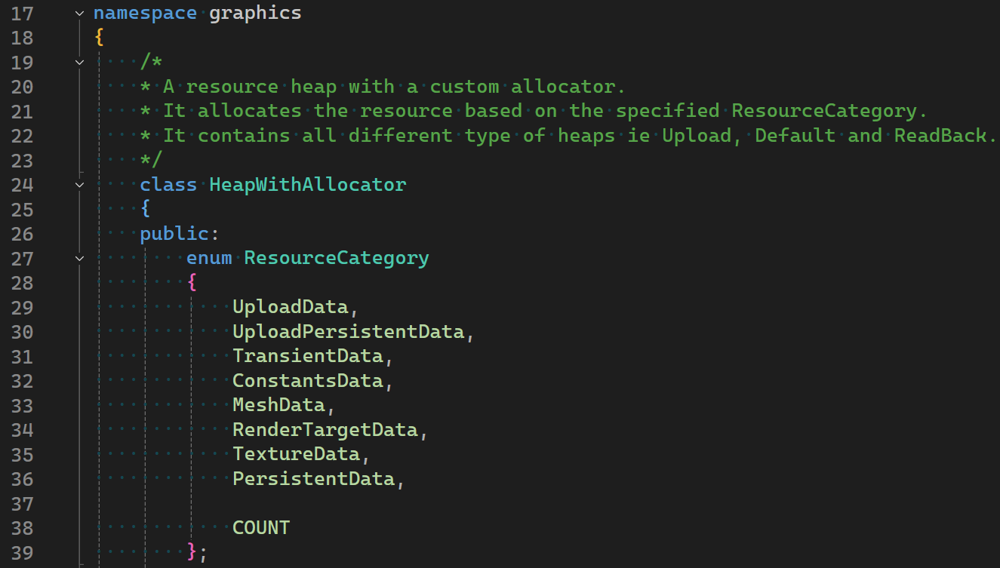

After a busy few months, I am back at this blog. This week we will take a deep dive into the GPU memory management in my small game engine. The system is in no way, shape or form perfect for AAA usage. However, I think it is quite cool, simple and easily scalable to such levels.


Gaming industry has thrived even when the device had very low memory, and efficient memory management has always been a major point of interest throughout the years. And many memory management techniques, such as resource streaming, were inevitable considering our passion behind making the perfect system for a perfectly smooth game experience.

Normally, user applications tend to rely on operating system (or an underlying system) to handle the memory, but for games we always see engines write their own management logic. We do this because that gives us an additional control on the data and since we usually know how & when it is needed, we can come up with faster, simpler and sometimes creative solutions that can allow our games to perform better. 

Even though in this new generation of game development, where developers have stopped thinking too much about memory management strategies and only need to care about learning one of the many ready made game engines available out there, these systems are always being used internally allowing a good memory usage (provided that the developers know what they are doing) and managing GPU Memory is no different. One can even argue that GPU memory management is even easier to manage compared to CPU memory because here we are usually only dealing with only two types of resources i.e buffers and textures. But I say it depends on the game's need and how you want the GPU to treat those buffers and textures.

So that brings us to what were my needs from this engine. Well... it is not easily explainable, but to put it simply...my goal from this engine is to allow me to tinker with any rendering topic (including memory management) without everything falling apart and needing a complete refactor. So I try to go for the simplest solution.
But due to my itch for designing the perfect system and writing the most awesome code to ever exist XD, I can not just leave it at "simple". So, the goal is to engineer it enough that it fits well with whatever, but it is simple enough to understand and change whenever, yet it somewhat resembles what modern game engines do, because afterall this exercise was also for me to understand the concept.
## ID3D12Heap
So to understand the memory management for GPUs, we first start with what is available at the lowest level. And since my engine is built using D3D12 api and this system is also written around the same, lets talk about the ID3D12Heap.

	ID3D12Heap interface (d3d12.h)
	A heap is an abstraction of contiguous memory allocation, used to manage physical memory. This heap can be used with ID3D12Resource objects to support placed resources or reserved resources.
	
	Inheritance
	The ID3D12Heap interface inherits from ID3D12Pageable.

Here is what [MSDN has to say about it](https://learn.microsoft.com/en-us/windows/win32/api/d3d12/nn-d3d12-id3d12heap). It says that it is a contiguous memory allocation from the physical memory. But this is just how it appears above the abstraction. Internally it is much more than this.
## The memory architecture
Referring from [a post on AMD GPU Open](https://gpuopen.com/learn/using-d3d12-heap-type-gpu-upload/):
When developing a graphics application using Direct3D 12 for a PC with a discrete graphics card, we work with 2 types of memory: system RAM located on the motherboard and video RAM (VRAM) located on the graphics card. The main processor (CPU) has fast and direct/local access to the system RAM, while the graphics processor (GPU) has fast and direct access to the VRAM. GPU has access to the system RAM via the PCIe bus but the communication is significantly slower.

On integrated GPUs, there is no discrete VRAM. Instead, the GPU and CPU share system memory. The memory is divided into regions, some of which are GPU optimized with different caching policies, but it's all fundamentally the same physical RAM. This is why on integrated graphics, the distinction between default heaps and upload heaps becomes more about cache coherency and access patterns than physical memory location.

[MSDN](https://learn.microsoft.com/en-us/windows/win32/api/d3d12/nn-d3d12-id3d12heap#inheritance) also mentions that the ID3D12Heap interface inherits from ID3D12Pageable.
ID3D12Pageable is the base interface for anything that actually occupies GPU memory and can be moved by window's display driver module. Both ID3D12Heap and ID3D12Resource (which we will discuss later) inherit the it. The key insight here is that Windows maintains a GPU memory manager at the OS level, sitting above the driver. This memory manager needs to track what's consuming VRAM and make decisions about what stays resident when memory gets tight.
This is where memory management differs in PC and consoles. Consoles do not have anything happening behind the scenes leaving more control on the developers. But since PC can have multiple applications running simultaneously, OS needs to provide virtually exclusive access to the GPU to all the apps. So using this table the OS evicts a few pageable resources based on when it was last accessed. You can [read more about Residency here](https://learn.microsoft.com/en-us/windows/win32/direct3d12/residency).

In essence, communication between system RAM and VRAM needs to go through the PCIe bus.
In the Direct3D 12 API, there are multiple ways to perform such a data upload. And it allows creating 4 types of heaps which is specified in the HeapDesc in D3D12_HEAP_PROPERTIES. 
- The DEFAULT heap is GPU visible and is the closest to the GPU chip allowing a quicker access for the processor.
- UPLOAD heap is a chunk of memory typically located in the system RAM which is accessible to both GPU and CPU. A typical way, and the way we do it in this implementation, to use this is to allocate some "staging" memory where the CPU writes the data and then a copy operation is performed to move it to the DEFAULT heap.
  [](https://gpuopen.com/learn/using-d3d12-heap-type-gpu-upload/)
  Since the UPLOAD heap is GPU visible as well, we can let GPU directly access the contents in shader.
- A third, not so commonly used, heap type is GPU_UPLOAD heap. It is some memory on the VRAM accessible to the CPU. This feature has existed for a long time, and it was known as Base Address Register (BAR). This special area of memory typically had only 256 MB. Modern PCs offer a possibility to extend it to the entire VRAM, making it all directly accessible to the CPU. This is called Resizable BAR (ReBAR) and needs to be explicitly enabled in UEFI/BIOS settings of the motherboard.
  [](https://gpuopen.com/learn/using-d3d12-heap-type-gpu-upload/)
- The fourth one is READBACK memory, this also resides in the system RAM. The GPU uses the PCIe bus to write data into system RAM. Modern GPUs can DMA directly to system memory, so they don't need CPU involvement for the transfer itself. However, synchronization is critical. You must ensure GPU writes have completed before the CPU tries to read, which is why you use fences to wait for GPU work to finish before mapping a readback heap.
## Creating a Heap
In d3d12, we use the [ID3D12Device::CreateHeap](https://learn.microsoft.com/en-us/windows/win32/api/d3d12/nf-d3d12-id3d12device-createheap) method to create a heap that can be used with placed and reserved resources. This internally initiates a very long sequence of operations across [multiple layers of the graphics stack](https://fgiesen.wordpress.com/2011/07/09/a-trip-through-the-graphics-pipeline-2011-index/).

First, the application code calls the CreateHeap() with a [D3D12_HEAP_DESC](https://learn.microsoft.com/en-us/windows/win32/api/d3d12/ns-d3d12-d3d12_heap_desc) struct. This structure provides:
```C++
  UINT64                SizeInBytes;
  D3D12_HEAP_PROPERTIES Properties;
  UINT64                Alignment;
  D3D12_HEAP_FLAGS      Flags;
```
This call goes into the D3D12 runtime, which is a Microsoft-provided DLL that sits between the application and the driver.  
The runtime performs validations such as the size is reasonable or the flags are compatible and if the validation layers are enabled, then it gives an extensive validation providing warnings about suboptimal usage patterns as well. The runtime maintains its own tracking structures for all D3D12 objects you create, which helps with debugging and validation.  
Once validated, the call passes down to the user-mode driver, which is vendor-specific code. This is where things get really interesting because the driver has deep knowledge about the actual GPU hardware and its capabilities. The driver examines the heap request in context of the current memory situation. It checks how much VRAM is currently available, what else is allocated, and whether the request can be satisfied immediately. The driver maintains its own memory manager that tracks allocations at a finer granularity than the application sees. Heap allocation might be carved out of a larger internal allocation, or it might require the driver to request new memory from the kernel.  
The driver then issues a call down to the kernel-mode driver, which runs the lowest level with full system privileges. The kernel driver is responsible for actually talking to the GPU hardware and managing the physical memory resources. It's the kernel driver that programs the GPU's memory management unit to set up the page tables that map virtual GPU addresses to physical memory locations.  
Modern GPUs can also use virtual memory much like CPUs do. When a heap is created, we get a virtual GPU address space. The GPU's MMU translates these virtual addresses to physical addresses in VRAM or system RAM. This virtualization is what allows the OS to page memory in and out, because it can change the page table mappings without the GPU's shader programs needing to know that addresses have been remapped.   
[](https://learn.microsoft.com/en-us/windows-hardware/drivers/display/gpummu-model) [Read more about the GPU MMU model here](https://learn.microsoft.com/en-us/windows-hardware/drivers/display/gpummu-model).

So as you can see, creation of heap and switching the active heap are quite heavy operations. So we create and bind one heap for the entire application or game during the loading and then we manage the resource placement internally.
## Resource Placement Into Heaps
Creating a placed resource within a heap using [CreatePlacedResource](https://learn.microsoft.com/en-us/windows/win32/api/d3d12/nf-d3d12-id3d12device-createplacedresource), carves out a sub region of the heap's virtual address space and giving it structure. The driver doesn't allocate new memory because the memory already exists in the heap. Instead, it creates a resource descriptor that defines how to interpret that region of memory.  
The driver calculates the actual GPU virtual address for the resource by taking the heap's base virtual address and adding the requested offset. It validates that the resource fits within the heap boundaries and that alignment requirements are met. Textures need 64KB alignment because of how the GPU's texture units are designed and how they manage memory access patterns for efficient filtering.

Now that we have a decent idea about how the memory works internally, we can take a look at how we can manage the resource placement.  
ID3D12Heap* holds the Heap object and here is a simple wrapper over the ID3D12Heap that creates the heap in the constructor by calling the `ID3D12Device::CreateHeap` and destroys it in the destructor.
```C++
/*
* Wrapper over ID3D12Heap
*/
class Heap
{
public:
    static constexpr uint64_t PLACEMENT_ALIGNMENT = D3D12_DEFAULT_RESOURCE_PLACEMENT_ALIGNMENT;

    struct Description
    {
        std::string name;
        size_t sizeInBytes;
        HeapType type;
    };

    // Creates and initializes an ID3D12Heap
    Heap(Device& device, const Description& createDescription);

    // Frees the heap.
    // Since mHeap is a ComPtr it gets released automatically when the Heap object is destroyed.
    ~Heap();

public:
    // Returns the raw pointer of ID3D12Heap.
    inline const ID3D12Heap* get() const { return mHeap.Get(); }
    inline ID3D12Heap* get() { return mHeap.Get(); }

public:
    static D3D12_HEAP_PROPERTIES toD3DHeapProperties(const Description& description);

private:
    Microsoft::WRL::ComPtr<ID3D12Heap> mHeap;
};
```
### Resource Types
When dealing with GPU resources, we generally categorize them into a few categories and we section our heap for each one of them. The core idea behind it is that the categories are not only based on the resource type, but we also categorize them based on residency ie how long do we plan to keep them in memory. And we do this to allow us to use different allocation strategies per categories to get minimum fragmentation.

Here is a possible way to section the heap into.
- TransientData: Mostly temporary data that is mostly only needed by one single render pass. This section is intended to have textures. And since we know it is not permanent, we can use ring allocation strategy to simply replace older data allocated at the beginning of the frame graph whenever we need more space for a newer allocation.
- MeshData: These are the vertices and indices of a mesh. In D3D, buffers have a strict alignment needs. So we use a block allocator with first fit strategy and coalescing where each allocation is of a fixed size block.
- RenderTargetData: A separate section just for render targets, with a ring allocation strategy.
- BufferData and TextureData: One section for buffers using block allocator and one section for textures using a linear allocator with first fit strategy and coalescing. These are the data that is shared between render passes on both graphics and compute pipe.
- PersistentData: This is a simple section at the end of the heap where we keep resources that need to stay through the lifetime of the game or level.
- UploadData: This is for a separate heap of type UPLOAD with ring allocation strategy.
- UploadPersistent: This is a section of UPLOAD heap where the data stays persistent but in the upload heap.
Using all these, we can write a new class which includes our heap wrapper that looks something like this. Where we make sections using a simple linear allocator and choose an appropriate allocator based on the resource category provided in the ResourceDescription. With some helper function overloads to create all the different type of GPU resources
```C++
/*
* A resource heap with a custom allocator.
* It allocates the resource based on the specified ResourceCategory.
* It contains all different type of heaps ie Upload, Default and ReadBack.
*/
class HeapWithAllocator
{
public:
    enum ResourceCategory
    {
        UploadData,
        UploadPersistentData,
        TransientData,
        ConstantsData,
        MeshData,
        RenderTargetData,
        TextureData,
        PersistentData,

        COUNT
    };

    struct ResourceDescription
    {
        ResourceCategory category;
        GPUResource::Description resource;
    };

public:
    HeapWithAllocator(Device& device);

    ByteAddressBuffer createByteAddressBuffer(const ResourceDescription& createDescription);
    StructuredBuffer createStructuredBuffer(const ResourceDescription& createDescription, const unsigned int elementCount, const unsigned int strideInBytes);
    TypedBuffer createTypedBuffer(const ResourceDescription& createDescription, const unsigned int elementCount, const unsigned int strideInBytes);
    Texture createTexture(const ResourceDescription& createDescription);
    RenderTarget createRenderTarget(Texture& texture, const RenderTarget::Type type = RenderTarget::Type::Color);

    void deallocateBuffer(const ByteAddressBuffer& buffer, const ResourceCategory category);
    void deallocateBuffer(const StructuredBuffer& buffer, const ResourceCategory category);
    void deallocateBuffer(const TypedBuffer& buffer, const ResourceCategory category);
    void deallocateTexture(const Texture& texture, const ResourceCategory category);

    inline void reset(const ResourceCategory category) { mAllocator.reset(category); }

    ~HeapWithAllocator() = default;

private:
    Device& mDevice;

private:
    /*
    * Custom allocator using the basic allocators from Core/Memory
    * Linear allocator is used to virtually segment the heap and a different allocator is used based on the resource category.
    */
    class ResourceAllocator
    {
    public:
        // Total memory budget of GPU memory.
        // This includes the budget of Upload heap and Readback heap as well.
        // 2 GB TOTAL.
        // 128 MB for upload heap.
        // 1664 MB for default heap.
        // 256 MB extra.
        static constexpr std::array<size_t, ResourceCategory::COUNT> MEMORY_BUDGET = {
            memory::MB(64), // Category::Upload
            memory::MB(64), // Category::UploadPersistent
            memory::MB(64), // Category::Constants
            memory::MB(64), // Category::Transient
            memory::MB(256), // Category::Mesh
            memory::MB(128), // Category::RenderTarget
            memory::MB(640), // Category::Texture
            memory::MB(256) // Category::Persistent
        };

    public:
        ResourceAllocator()
            :
            mUploadHeapSections(memory::MB(128)),
            mUploadData(MEMORY_BUDGET[ResourceCategory::UploadData], mUploadHeapSections.allocate(MEMORY_BUDGET[ResourceCategory::UploadData])),
            mUploadPersistentData(MEMORY_BUDGET[ResourceCategory::UploadPersistentData], mUploadHeapSections.allocate(MEMORY_BUDGET[ResourceCategory::UploadPersistentData])),
            mDefaultHeapSections(memory::MB(1664)),
            mConstants(MEMORY_BUDGET[ResourceCategory::ConstantsData], 256, mDefaultHeapSections.allocate(MEMORY_BUDGET[ResourceCategory::ConstantsData])),
            mTransientData(MEMORY_BUDGET[ResourceCategory::TransientData], mDefaultHeapSections.allocate(MEMORY_BUDGET[ResourceCategory::TransientData])),
            mMesh(MEMORY_BUDGET[ResourceCategory::MeshData], 128, mDefaultHeapSections.allocate(MEMORY_BUDGET[ResourceCategory::MeshData])),
            mRenderTarget(MEMORY_BUDGET[ResourceCategory::RenderTargetData], mDefaultHeapSections.allocate(MEMORY_BUDGET[ResourceCategory::RenderTargetData])),
            mTexture(MEMORY_BUDGET[ResourceCategory::TextureData], mDefaultHeapSections.allocate(MEMORY_BUDGET[ResourceCategory::TextureData])),
            mPersistentData(MEMORY_BUDGET[ResourceCategory::PersistentData], mDefaultHeapSections.allocate(MEMORY_BUDGET[ResourceCategory::PersistentData]))
        {
        }

        // Allocates the sizeInBytes and returns an allocation offset for the specified category.
        inline uint64_t allocate(const ResourceCategory category, const size_t sizeInBytes)
        {
            std::lock_guard<std::mutex> scopedLockGuard(mMutex[category]);

            switch (category)
            {
            default:
            case ResourceCategory::COUNT:
                HASSERT(false, "Invalid resource category ", category);
                break;
            case ResourceCategory::UploadData:
                return mUploadData.allocate(sizeInBytes);
            case ResourceCategory::UploadPersistentData:
                return mUploadPersistentData.allocate(sizeInBytes);
            case ResourceCategory::ConstantsData:
                return mConstants.allocate(sizeInBytes);
            case ResourceCategory::TransientData:
                return mTransientData.allocate(sizeInBytes);
            case ResourceCategory::MeshData:
                return mMesh.allocate(sizeInBytes);
            case ResourceCategory::RenderTargetData:
                return mRenderTarget.allocate(sizeInBytes);
            case ResourceCategory::TextureData:
                return mTexture.allocate(sizeInBytes);
            case ResourceCategory::PersistentData:
                return mPersistentData.allocate(sizeInBytes);
            }
        }

        // Provides a method to deallocate a specific offset but since ring allocators reuse the memory, no deallocation happens for ring.
        inline void deallocate(const ResourceCategory category, const uint64_t allocationOffset, const size_t sizeInBytes)
        {
            std::lock_guard<std::mutex> scopedLockGuard(mMutex[category]);

            switch (category)
            {
            default:
            case ResourceCategory::COUNT:
            case ResourceCategory::UploadData:
            case ResourceCategory::RenderTargetData:
            case ResourceCategory::PersistentData:
            case ResourceCategory::TransientData:
                //HASSERT_SOFT_ONCE(false, "Invalid resource category %d. No deallocation will happen.", category);
                break;
            case ResourceCategory::UploadPersistentData:
                mUploadPersistentData.deallocate(allocationOffset, sizeInBytes);
                break;
            case ResourceCategory::ConstantsData:
                mConstants.deallocate(allocationOffset, sizeInBytes);
                break;
            case ResourceCategory::MeshData:
                mMesh.deallocate(allocationOffset, sizeInBytes);
                break;
            case ResourceCategory::TextureData:
                mTexture.deallocate(allocationOffset, sizeInBytes);
                break;
            }
        }

        // Resets the allocator for the specified ResourceCategory.
        inline void reset(const ResourceCategory category)
        {
            std::lock_guard<std::mutex> scopedLockGuard(mMutex[category]);

            switch (category)
            {
            default:
            case ResourceCategory::COUNT:
                HASSERT(false, "Invalid resource category ", category);
                break;
            case ResourceCategory::UploadData:
                mUploadData.reset();
                break;
            case ResourceCategory::UploadPersistentData:
                mUploadPersistentData.reset();
                break;
            case ResourceCategory::ConstantsData:
                mConstants.reset();
                break;
            case ResourceCategory::TransientData:
                mTransientData.reset();
                break;
            case ResourceCategory::MeshData:
                mMesh.reset();
                break;
            case ResourceCategory::RenderTargetData:
                mRenderTarget.reset();
                break;
            case ResourceCategory::TextureData:
                mTexture.reset();
                break;
            case ResourceCategory::PersistentData:
                mPersistentData.reset();
                break;
            }
        }

        ~ResourceAllocator() = default;

    private:
        memory::LinearAllocator mUploadHeapSections;
        memory::RingAllocator mUploadData;
        memory::SuballocationAllocator mUploadPersistentData;

        memory::LinearAllocator mDefaultHeapSections;
        memory::BlockAllocator mConstants;
        memory::RingAllocator mTransientData;
        memory::BlockAllocator mMesh;
        memory::RingAllocator mRenderTarget;
        memory::SuballocationAllocator mTexture;
        memory::LinearAllocator mPersistentData;

        std::array<std::mutex, ResourceCategory::COUNT> mMutex;
    };

    ResourceAllocator mAllocator;

private:
    Heap mUploadHeap;
    Heap mDefaultHeap;
    // Heap mReadbackHeap;

    inline Heap& getBackingHeap(const ResourceCategory category)
    {
        switch (category)
        {
        case ResourceCategory::UploadData:
        case ResourceCategory::UploadPersistentData:
            return mUploadHeap;

        case ResourceCategory::TransientData:
        case ResourceCategory::ConstantsData:
        case ResourceCategory::MeshData:
        case ResourceCategory::RenderTargetData:
        case ResourceCategory::TextureData:
        case ResourceCategory::PersistentData:
        case ResourceCategory::COUNT:
        default:
            return mDefaultHeap;
        }
    }
};
```
## Descriptor Heaps
A descriptor in D3D12 is a small, well-defined block of data that lives in GPU accessible memory and tells the GPU hardware directly how to interpret and access a resource. We can think of a descriptor as a view of a resource. Same resource can have different views which specify a separate way to interpret the data.  
Which is a good reason to keep them separate from the actual GPU resources and allowing the users to create them on demand. But when it comes to managing them it is no different than ID3D12Heap. In fact, it gets easier here because descriptors are a fixed size structs so when it comes to managing the offset, it is quite simple and can be done using a simple ring allocator.
However, when we pair it with resource binding to the shaders, the process gets more intricate which we will take a look in the next blog.  
But just for memory management for descriptors, it can be kept same as the resource heap with 4 separate descriptor heaps for ShaderViewsCPU, ShaderViewsGPU, RenderTargetCPU and DepthStencilCPU.
## Putting it all together
We have done a deep dive into the GPU's memory hierarchy, created a small wrapper over the ID3D12Heap and defined a clear way to categorize the resources so that an appropriate allocation strategy can be chosen. The descriptor's memory management is also the same.

If you have any suggestions or comments and you like this post or you want to learn more, lets connect on twitter [@JayNakum_](https://twitter.com/JayNakum_) or linkedin [@JayNakum](https://www.linkedin.com/in/jaynakum/).
## Thanks for reading, Aavjo!
&copy; 2026-present Jay Nakum. All rights reserved.  
Any direct or indirect use of all content requires prior written permission. No AI training allowed.
