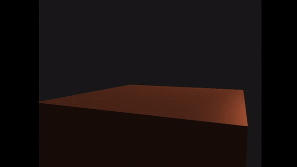
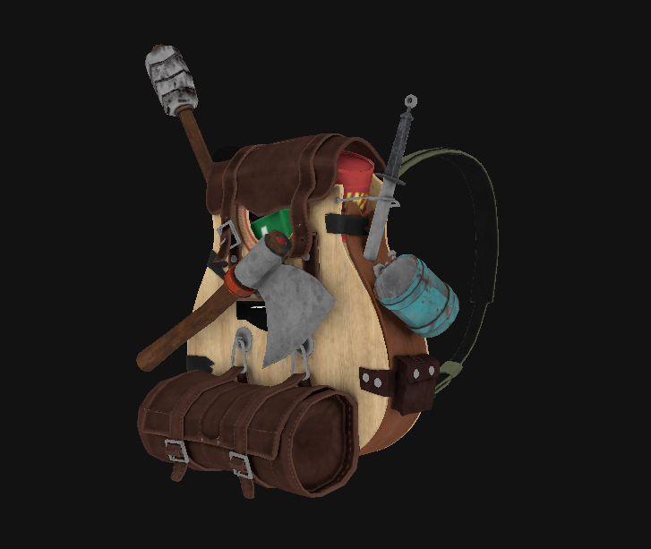

# Happy Face: An OpenGL Renderer



Hello hello people of the earth! Welcome to my first blog post. In this post I will be explaining a small project that I developed a while back. As the title suggests, it is an OpenGL renderer called HappyFace.  
When I started learning computer graphics and OpenGL, I wanted to implement all the things that I was learning into one single project and that's how this project began. This project is basically an abstraction over the concepts that I learnt from various different resources. Some of the which are mentioned later in this post.
## Understanding the project structure
The idea was that whenever someone wants to use this "engine" they would simply include a singular header file `HappyFace.h` and that's it, the complexity of the rendering is fully abstracted. If the user wants to load in custom resources such as shaders, textures and 3D models (from other software like blender); those would be placed in the `resource` directory.
```
HappyFace.vcxproj
	resources
		objects
		shaders
		textures
	src
		HappyFace
			Components
			Core
			GL
			Platform
			Utility
			HappyFace.h
		TestApp.cpp
	vendors
```
The entirety of the magic happens in the `src\HappyFace`. It contains all the component classes, core classes, OpenGL implementations, window management & event handling and utility functions.
## A look under the hood: Engine
I followed a top down approach during the development. That is, I would first decide how the top/user level code would look like and then work my way down on implementing the modules required to implement that.  
`HappyFace\Core` is the root of the project containing following modules:
1. Entry Point
2. Application
3. Scene
4. Renderer
**Entry Point**
I learnt this approach from [Cherno](https://www.youtube.com/@TheCherno) and this is where the main methods resides. The benefit of doing this that the engine is in full control rather than the user. It allows the engine to control what happens before the it is loaded, during the rendering and after the shut down. This ultimately prevents memory leaks and unusual crashes.  
**Application**
It is a base class that initializes the project. Initialization includes creating a window, initializing the renderer and setting callbacks for event handling. Users extends this class to create their own application with their custom parameters such as Application Name, title of the window, size of the window etc. The application class contains an instance of a scene and the renderer.  
**Scene**
This class can be describes as "a custom data structure to store the components which can be accepted by the renderer". Users are allowed to create their custom scenes by extending this class. An example of a custom scene is provided in the `src/TestApp.cpp`. This scene is then passed on to the renderer.  
**Renderer**
The main job of the renderer is to draw the provided scene. It initializes OpenGL with the provided settings. Renderer draws the scene and it updates the window every frame called the "main loop". It also contains an instance of a debug camera that allows the users to move in the scene. Renderer manages the drawing and for that it also handles the shaders i.e. what shader to use, setting the uniform variables etc.  


`HappyFace\GL` contains and abstraction over the core OpenGL functions for:
1. Vertex Arrays
2. Vertex Buffers
3. Index Buffers
4. Shaders
5. Textures
What are these you ask? Well, [Joey](https://twitter.com/JoeyDeVriez) does a better job at explaining on [learnopengl.com](https://learnopengl.com/). In my [opinion](https://x.com/JayNakum_/status/1575728655640076289), this is THE BEST resource to learn computer graphics and OpenGL.  
`HappyFace\Platform` handles window creation and event handling.  
`HappyFace\Components` contains data structures to hold the scene components:
- Model and Mesh
- Lights
`HappyFace\Utility` contains the "resource manager". Resource manager manages loading files for textures and shaders from the `resources` directory.
## Reviews and Resources
This is truly one of my favorite projects. I am proud of this work because it is my honest hard work and the learnings from this project are priceless. I believe that this is the project that got me into Ubisoft. I learnt a lot about computer graphics, game engines and OpenGL during the development, I learnt how to handle larger codebases and I have tried to follow good coding standards as well, although coming from a Java background I was already in a habit of writing code in similar style. During the development, I came across some useful resources:
- [learnopengl.com](https://learnopengl.com/): THE BEST
- [Cherno's OpenGL Series](https://youtube.com/playlist?list=PLlrATfBNZ98foTJPJ_Ev03o2oq3-GGOS2&si=0UgJomgpfAWVqDaM): This is the channel that made me fall in love with computer graphics. At the time of writing this blog, it is one and only channel on YouTube that produces quality tutorials in this domain.
- [Thin Matrix's 3D Game Engine Series](https://www.youtube.com/playlist?list=PLRIWtICgwaX0u7Rf9zkZhLoLuZVfUksDP): This is the only resource I have found that uses Java. Although I am working with C++, this playlist gave me better understanding at how game engines look like and how each functionality is divided into various modules. As this is an older tutorial I found it difficult to setup the project in eclipse.
- [Modern OpenGL Tutorials](https://ogldev.org/): I've never really followed this tutorial but it was recommended to me on reddit.
- [Scratchapixel](https://www.scratchapixel.com): Unlike other resources mentioned above, it doesn't have a proper tutorial series (not that I found). But the articles published by them are very very useful.

If you have any suggestions or comments and you like this project, let me know on twitter [@JayNakum_](https://twitter.com/JayNakum_). You can check out the repository on GitHub!  
[](https://github.com/JayNakum/HappyFace)
## Thanks for reading, Aavjo!